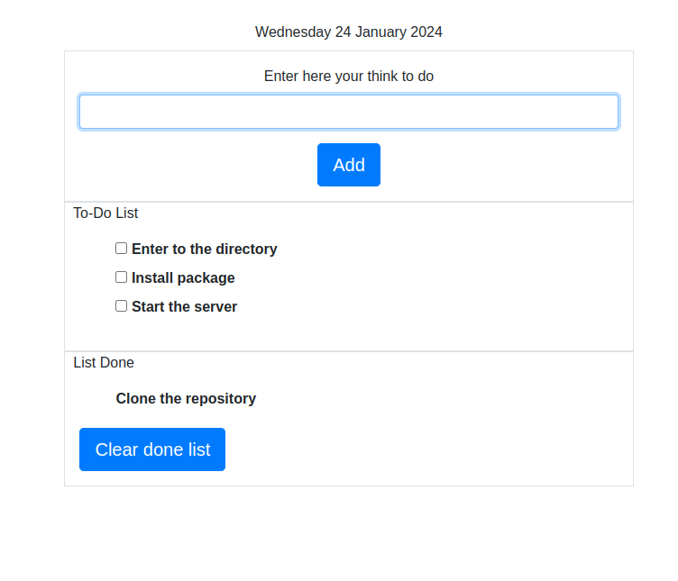

## To-Do List

**To-Do List** is a simple app written in *html*, *css*, *javascript* to list the tasks that you have to do, or things that you want to do.        
        

###### It's a part of the **The Complete 2023 Web Development Bootcamp** challenge by Angela Yu. ######


#### Installation
To get started with the "To-Do List", follow these steps:

1. **Clone** the repository:

```sh
git clone https://github.com/resole79/to-do-list.git
```

2. **Enter** to the directory:        

```sh
cd to-do-list
```

3. **Install** package:        

```sh
npm install
```

4. **Start** the server:        
 
```sh
node index.js
```

#### *File Structure*         

 - **public**        
    - **css/css.css**        
    - **js/js.js**        
 - **views/index.ejs**          
 - **index.js**
 - **package.json**
          
          
#### **Usage**


**How web site present**




## **Credit**

Author : Emilio Reforgiato (resole79)

##
<p align="right"><a href="https://www.linkedin.com/in/emilio-reforgiato/" target=”_blank” ></a></p>


